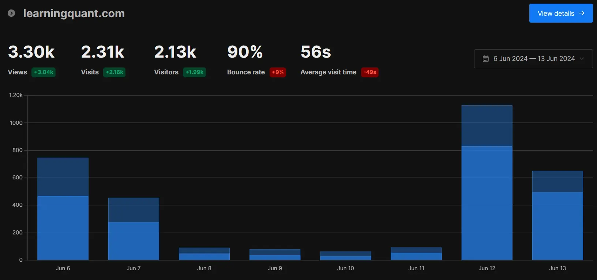
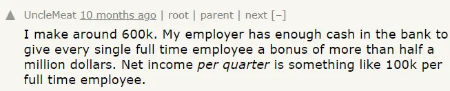
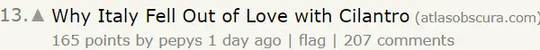
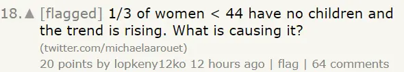

If you want to raise awareness about your product/service/blog, you should try talking about it on [Hacker News](https://news.ycombinator.com/).

Want proof? Here are some stats for a blog I started last month\*:

I generated **2.3k unique visits** from 2 posts I wrote and then shared on the website.

The average reader has a lot of buying capacity, too. You'll routinely see US-based software engineers sharing how they earn +$500k per year:

What kind of content does well? Sounds obvious, but it's anything that the personas I mentioned would like to talk about.

You're probably assuming only "tech-y stuff" will work? Wrong! There are plenty of conversations that went viral around topics way outside the community's primary focus. Here are some examples I spotted, just from today's feed:

While the content can be quite diverse, it must pass a certain bar around quality and authenticity. [This post](https://brooker.co.za/misc-blog/2024/01/23/skis.html) demonstrates my point - it's a hobbyist skier's personal take on whether skis get blunt. It's got [130 comments on Hacker News](https://news.ycombinator.com/item?id=40902740) in 9 hours, which probably will result in 10-20k visits to the blog.

So in case you were wondering, ChatGPT hacks won't work :)

 

\* _only to put on the back burner shortly thereafter ^\_^|||_
