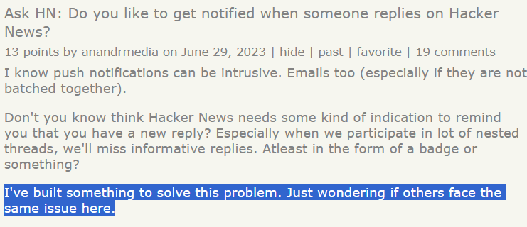

Hopefully I've managed to convince you with my previous post [why you should
try to market your tech startup on Hacker News](./hacker-news-for-marketing). The next question
is - how?

Many different ways, there are, young padawan. Dig in, we shall.

## Show HN post

This is the most common option - with which you talk about what you've created. It can take two forms...

_numero unos - text post with a link_

_numero dos - post with link and a comment_

While the platform gives no preference to either of the two, I personally think the 2nd one increases
your chances of making it on the front page. This is because users tend to check posts with comments more often.

You must follow [some official rules](https://news.ycombinator.com/showhn.html) when making such a post. There are also plenty of unoficial guides online on what makes a post go viral - Google is your friend. I'd encourage you to read these resources before you post as you're only allowed to submit it once.

## Sharing blog posts

You can set up a blog site associated with your business and share every post you write on Hacker News. Again, there are [some guidelines you must follow](https://news.ycombinator.com/newsguidelines.html).

## Show HN post for sub-product / service

I mentioned that you can only make a single Show HN post about your business. One way to get around this is to
submit a product/service that's related to your main product. Take this post for example:

## Ask HN post

This is when you ask a question and you mention the startup you're working on.

I've rarely seen this work to be honest, but I figured I should mention it just in case.

## Comments

You can get involved in conversations related to your product.

If you're wondering how you can find such conversations - not to worry, there are plenty of automated services out there.
I use [F5Bot](https://f5bot.com/), which is free. There are paid products out there too, you should be able to find them quite easily.

## Final words

Hopefully I've inspired you to post about your product! If you're about to do that, check out a little free web app I built that sends notifications every time you get a comment/reply on the platform: https://hackernewsalerts.com/
