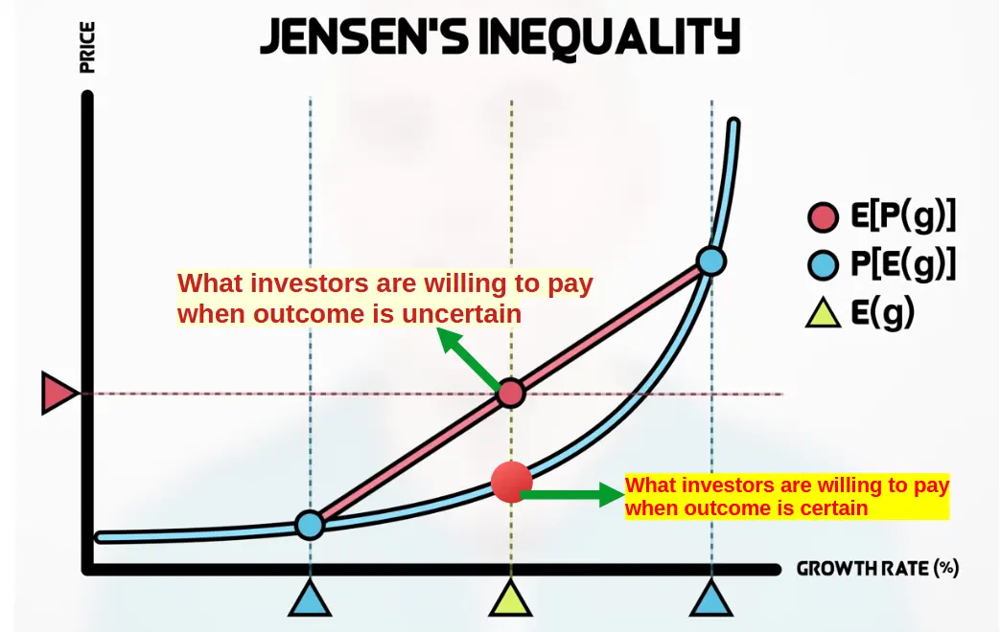

I'm struggling to learn about algo trading so I decided to semi-procrastinate by
reviewing one of my favorite [YouTube videos](https://youtu.be/UZnVt_CvL3k) from Ben Felix.
The subject of the video? Investing in technological revolutions. Figured it's good timing
given the [AI craze that's taken over the markets](https://apnews.com/article/nvidia-artificial-intelligence-stock-market-nasdaq-b1e79cf391f212a4714433afd140e341).

The premise is that such revolutions exhibit the same pattern:

1. There's a major breakthrough with the potential to increase productivity.
2. A financial bubble emerges, as businesses try out the new technology with the hopes of achieving huge profits.
3. Companies realise they can't make as much money from the innovation as they hoped, leading to the collapse of the bubble.
4. The technology is adopted with realistic expectations about what it can achieve.

There are plenty of examples in history, involving [canals](https://en.wikipedia.org/wiki/Canal_Mania), [railways](https://en.wikipedia.org/wiki/Railway_Mania), [bicycles](https://en.wikipedia.org/wiki/History_of_the_bicycle#The_safety_bicycle_and_the_bike_bubble:_1880s_and_1890s), [automobiles](https://en.wikipedia.org/wiki/History_of_the_bicycle#The_safety_bicycle_and_the_bike_bubble:_1880s_and_1890s), [the internet](https://en.wikipedia.org/wiki/Dot-com_bubble). And, last but not least, [mortgage-backed securities](https://en.wikipedia.org/wiki/Subprime_mortgage_crisis).

At this point, you might be asking yourself - why do we keep falling for these bubbles? This is because it might actually be a **somewhat rational behavior**. Yes, you read that right.

In [their paper about the dot-com bubble](https://papers.ssrn.com/sol3/papers.cfm?abstract_id=559231), Pastor and Veronesi show mathematically how higher uncertainty about companies' profitability results in investors being willing to accept higher prices
for those companies. This assumes that there's a convex relationship between prices and dividend growth rates, as per the [Gordon Growth Model](https://www.investopedia.com/terms/g/gordongrowthmodel.asp).

The flip side is that, once it becomes clearer how profitable these companies truly are, prices will fall.

By this point, you've probably realised what I'm going to say about the likes of Nvidia and ARM. But I also hope I've
clearly explained a framework for analysing financial markets' response to technological revolutions, as there will be many more to come.
