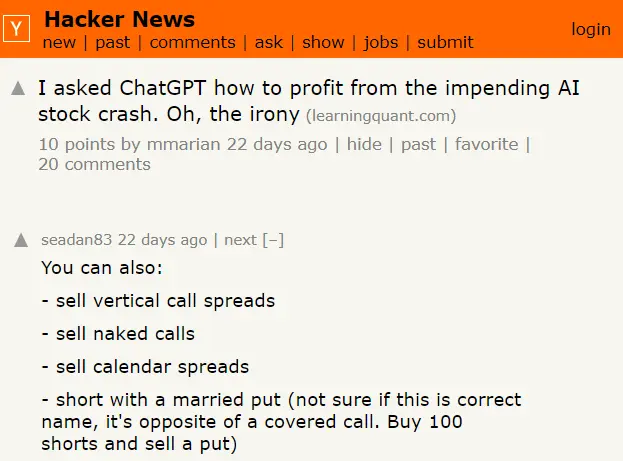
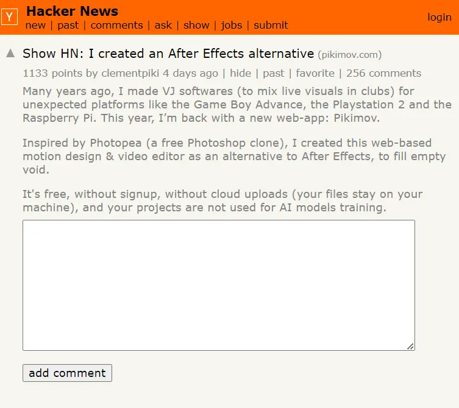
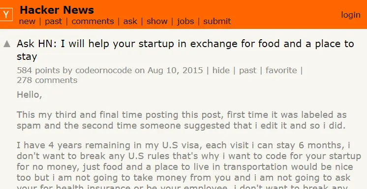
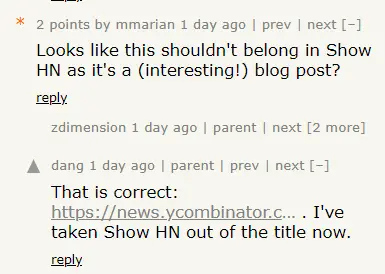

I've been sharing [what I'm working on](/) with marketers and entrepreneurs I meet in person. But I noticed I'm often getting confused looks. Why? Because they've never heard of [Hacker News](https://news.ycombinator.com/) before\*!

As an avid user (read - addict) of the website, that really struck me. I naively assumed that most people who fit those personas would consider it as a distribution channel. Clearly not. So let me try and make a small dent in this world by explaining what this thing called Hacker News is.

**The TLDR - it's an online forum for people involved in tech and startups.**

You're more than welcome to share whatever you've created. Whether it's a blog post...

...a software product...

...or even a service.

Wondering how it differs from Reddit? The answer is in the quality of the posts and comments.

It's heavily moderated by the people who run it - [Y Combinator](https://www.ycombinator.com/), the world's first (and most famous) startup accelerator. The community helps, too. No flaw in product or thought goes unnoticed.

While you do need to have a thick skin to share stuff on the platform, it can unlock some opportunities for your business.
[I'll explain why in my next post](./hacker-news-for-marketing).

 

\*_In case you're wondering, I live in Milton Keynes, UK; [the most boring place in the world](https://x.com/NetflixUK/status/1506962123854913536) according to some._
