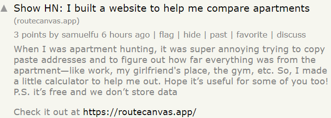
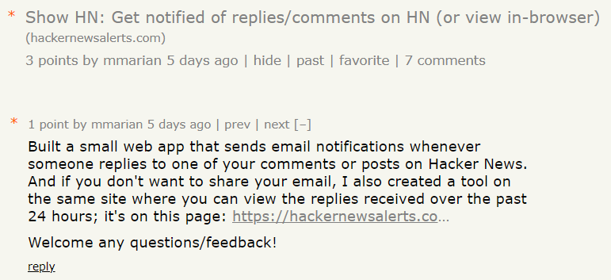
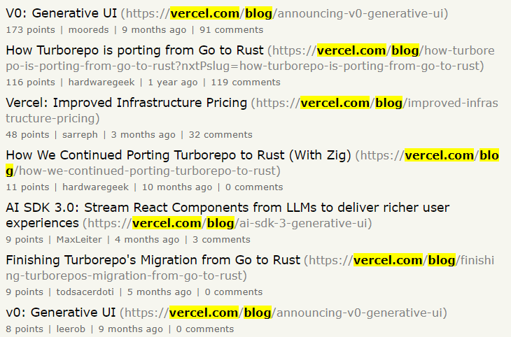
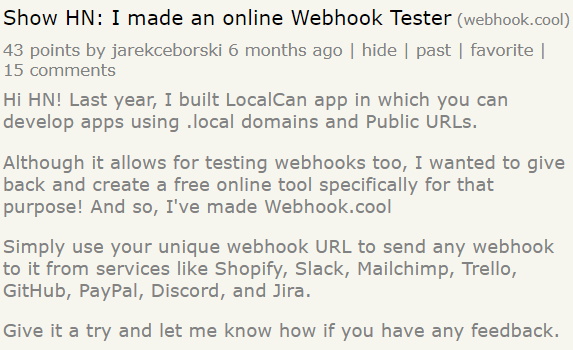

Hopefully I've managed to convince you with my previous post [why you should
try to market your tech startup on Hacker News](./hacker-news-for-marketing). The next question
is - how?

Many different ways, there are, young padawan. Dig in, we shall.

## Show HN post

This is the most common option - with which you talk about what you've created. It can take two forms...

_numero unos - text post with a link_

_numero dos - post with link and a comment_

While the website gives no preference to either of the two, I personally think the 2nd one increases
your chances of making it on the front page. This is because users tend to check posts with comments more often.

There are [official rules](https://news.ycombinator.com/showhn.html) you must follow. There are also plenty of unoficial guides online on what makes a post go viral - Google is your friend.

## Sharing blog posts

## Show HN - sub-product / service

## Ask HN

## Comments
